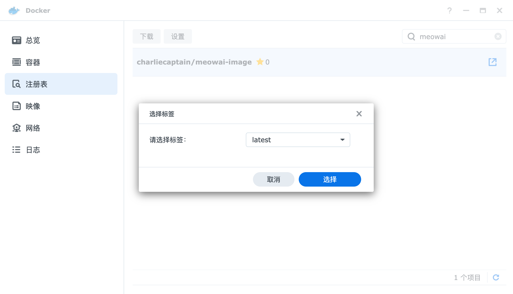
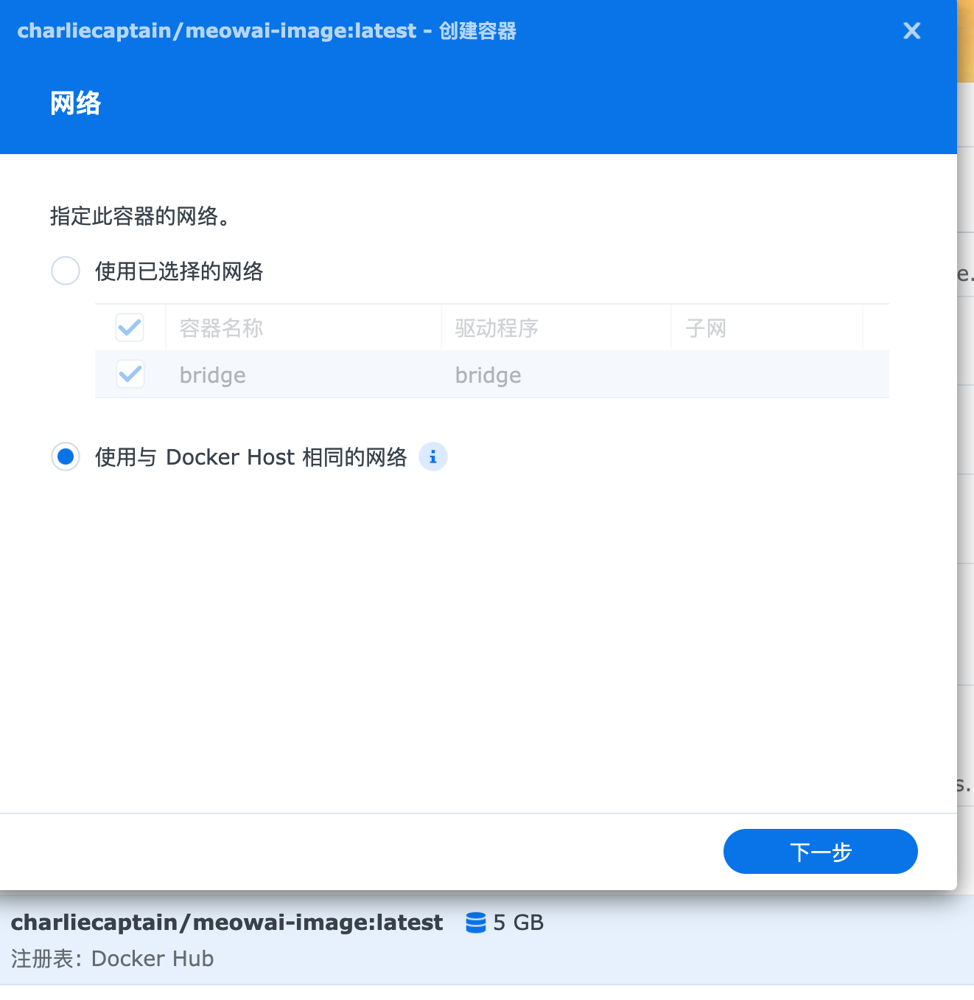
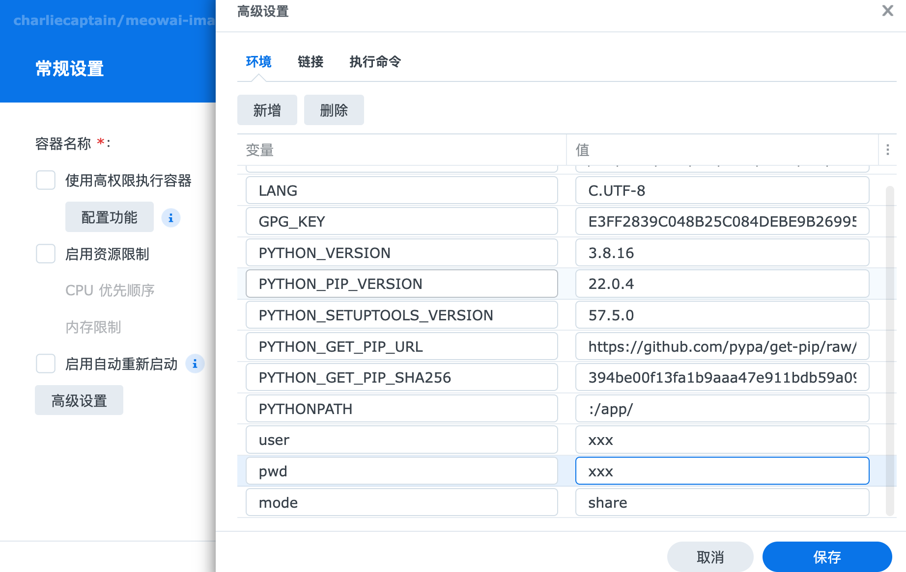

# MeowAI

Use Yolov5 to perform offline detection on images and add tags to the images in Synology Photos, supporting the recognition of 80 scenes.

[中文文档](./README-CN.md)

## How

Extract thumbnail images using Synology API and add labels to images using offline yolov5 model.

## Usage

### Docker shell (Recommend)

1. pull docker image
    ```
    //arm64 [600MB]
    docker pull charliecaptain/meowai-image:latest-arm-linux

    //x86-64 [2G]
    docker pull charliecaptain/meowai-image:latest
    ```

2. run docker container

    ```shell
    docker run -it 
            --name meowai 
            -e user="xxx" 
            -e pwd="xxx" 
            -e mode="person" 
            -e detect_class="[\"cat\",\"dog\"]"
            --network host 
            meowai_image
    ```

### Synology DSM

This will consume your CPU resources.

1. download docker image
   

2. run docker
   

   


### Shell

1. git clone repository
2. install requirements.txt
    ```
   pip3 install -r requirements.txt
   pip3 install -r yolov5/requirements.txt
   pip3 install torch torchvision
   ```
3. run py
   ```
    user="xxx" pwd="xxx" mode="xxx" detect_class="[\"cat\",\"all\"]" python3 main.py
    ```


### Arguments

| Argument     | Description                                  | Demo               | Require                       |
| ------------ | -------------------------------------------- | ------------------ | ----------------------------- |
| user         | login user                                   | -                  | true                          |
| pwd          | login password                               | -                  | true                          |
| ip           | nas ip                                       | 0.0.0.0:5000       | false(default 127.0.0.1:5000) |
| mode         | person dir or share dir                      | "person" or"share" | false(default person)         |
| detect_class | detect scenes, see src/detect/detect_dict.py | ['cat','dog']      | false(default ['all'])        |
| model        | yolov5 model pt file name                    | yolov5m6            | false(default yolov5m6)        |


## Dev

Currently using the yolov5m6.pt dataset, which can be changed to a larger dataset, more can be viewed on the
website [Yolov5-Github](https://github.com/ultralytics/yolov5).

### Build Docker

1. install docker
2. git clone project
3. build docker image
    ```
    chmod 777 ./build.sh
    ./build.sh
    ```
4. run docker

## Q&A

### How to remove all tags
```shell
user="xxx" pwd="xxx" mode="xxx" detect_class="[\"all\"]" python3 src/util/util.py
```

## Thanks

https://github.com/zeichensatz/SynologyPhotosAPI

## Donate

TRC20(USDT): TKRJkxUWYnnjLXVjN5Nutk6cvZ3Nz3S9pv


## License

```
MIT License

Copyright (c) 2023 Charlie

Permission is hereby granted, free of charge, to any person obtaining a copy
of this software and associated documentation files (the "Software"), to deal
in the Software without restriction, including without limitation the rights
to use, copy, modify, merge, publish, distribute, sublicense, and/or sell
copies of the Software, and to permit persons to whom the Software is
furnished to do so, subject to the following conditions:

The above copyright notice and this permission notice shall be included in all
copies or substantial portions of the Software.
```